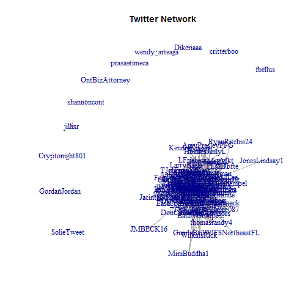
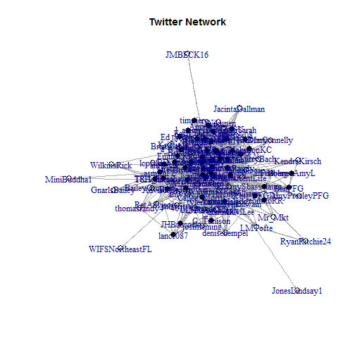

Twitter Analysis
========================================================
**Jessica Short**

Background & Objective
--------------------------------------------------------
Many insurance and financial products are sold through advisors. There is a biweekly twitter meetup for advisors to talk about relevant industry trends and strategies. These conversations are identified with specific hashtags. This project walks through the process of collecting tweets in this conversation series and mapping relationships between the users.

Data Collection
--------------------------------------------------------
Data collection was completed in R, utilizing the twitteR package in order to pull data from twitter, using my personal developer account. I also utilize dplyr and lubridate to get the data in suitable format. Packages ggplot2 and igraph were utilized for graphing. Final report was compiled using R Markdown and knitr.
### Twitter Developer Accounts
In order to have access to twitter information through the API, I set up a developer account following the directions provided by [this blog post](http://thinktostart.wordpress.com/2013/05/22/twitter-authentification-with-r/)

The consumerKey and consumerSecret are masked below, any attempt to re-create the data collection would require your own developer account credentials. 


```r
library(RCurl)
library(twitteR)

reqURL <- "https://api.twitter.com/oauth/request_token"
accessURL <- "https://api.twitter.com/oauth/access_token"
authURL <- "https://api.twitter.com/oauth/authorize"
consumerKey <- "#################"
consumerSecret <- "####################################"

twitCred <- OAuthFactory$new(consumerKey = consumerKey, consumerSecret = consumerSecret, 
    requestURL = reqURL, accessURL = accessURL, authURL = authURL)

twitCred$handshake(cainfo = system.file("CurlSSL", "cacert.pem", package = "RCurl"))

registerTwitterOAuth(twitCred)

```


### Bi-Weekly Tweet Collection
Tweets needed to be collected on a regular basis because tweets are no longer searchable through the API after about 2 weeks. The code below was used to collect all the relevant tweets on a bi-weekly basis. The data was then saved off to be analyzed later. 

Collection is also affected by rate limiting as described on the [twitter developers website](https://dev.twitter.com/). Rate limiting is the reason for the inclusion of sys.sleep() in the functions used below. 


```r
term<-########
rsTweets <- searchTwitter(term, n=500)
tweets.df2<-twListToDF(rsTweets)

users<-unique(llply(rsTweets,screenName))

#have to use a function so the system won't rate limit 
at<-data.frame()
for (user in users){
   # Download latest 100 tweets from the user's timeline
   tweets <- twListToDF(userTimeline(user,n=100,includeRts=TRUE))
   at<-rbind(at,tweets)
   Sys.sleep(25)
}

saveRDS(tweets.df2, file=paste0("AT_",today(),".Rdata"))
saveRDS(at, file=paste0("UserHist_",today(),".Rdata"))

```


### Final Data Collection 
The dates where tweets were collected are 
\begin{itemize}
  \item 03-05-2014
  \item 03-20-2014
  \item 04-06-2014
\end{itemize}

I waited until all the sessions of interest were completed in order to collect the user details and friendships. The intent was to simplify the project, but this ended up complicating the project more. One user deleted their account between participation and final data collection.

Ideally, I would also like to see relationships and user statistics at the time of participation to evaluate changes. But this is satisfactory for an exploratory effort. 

```r
collectDates <- c("2014-03-05", "2014-03-20", "2014-04-06")

# AT_test is the list of Conversation tweets
AT_test <- ldply(collectDates, function(x) {
    res <- readRDS(paste0("AT_", x, ".Rdata"))
    res$ext_dt <- x
    res
})


# UH_test is all the tweets for users that participated in the conversations
UH_test <- ldply(collectDates, function(x) {
    res <- readRDS(paste0("UserHist_", x, ".Rdata"))
    res$ext_dt <- x
    res
})

```


#### User Details
At this point, I did some data cleaning and also calculated some summary statistics regarding each user and collected details about their account. 


```r
# drop the retweets from the AT_test collection
AT_test_noRT <- subset(AT_test, !isRetweet)
UH_test2 <- UH_test[!duplicated(UH_test$id), ]

# get users account details
at_users <- twListToDF(lookupUsers(unique(AT_test_noRT$screenName)))
at_uids <- at_users$id

# AT participation stats
AT_summ <- ddply(AT_test_noRT, .(screenName), summarise, n_AT_tw = length(id), 
    n_AT_ses = length(unique(ext_dt)), n_AT_RT = sum(retweetCount))

# general stats on user history
userStats <- ddply(UH_test2, .(screenName), summarise, min_dt = min(created), 
    max_dt = max(created), n_tw = length(screenName), avg_RT = (sum(retweetCount)/n_tw))
userStats <- subset(userStats, screenName %in% AT_summ$screenName)
userStatsFinal <- merge((at_users[, c(13, 1:12, 14:16)]), merge(userStats, AT_summ, 
    by = "screenName"), by = "screenName")

# search term masked
userStatsFinal$aflg <- grepl("XXX|XXXXXXXXXX|XXXXX", userStatsFinal$description, 
    ignore.case = TRUE)
table(userStatsFinal$aflg)

```


One of the interesting features in collecting the data was that retweets are returned in the searches. But by default, are not included in the user's history. This can be adjusted in the twitteR function UserTimeline by setting the includeRts option. I chose to eliminate retweets from the talk sessions, since the user who re-tweets is not generating their own content, and the original author will get credit for that re-tweet.

#### Friendship Collection
I then turned my attention to collecting a measure of a relationship between 2 participating users. For this case study, I am using friendship, where your friends are users that you follow. 


```r
friends_df <- ldply(at_uids, function(x) {
    Sys.sleep(60)
    x1 <- getUser(x)$getFriendIDs()
    x2 <- x1[x1 %in% at_uids]
    return(data.frame(cbind(node_id = x, friend_id = x2, friend = 1)))
})

```

That covers most of the data collection steps, so we can now load the dataframes which were saved off to save calculation time and continue with the analysis.

```r

library(plyr)
library(lubridate)
library(ggplot2)
library(igraph)

userStatsFinal <- readRDS("userStats415.Rdata")
friend_edge <- readRDS("friends415.Rdata")
userStatsFinal <- userStatsFinal[, c(2, 1, 3:23)]

```

The following variables are now available for each user:   id, screenName, description, statusesCount, followersCount, favoritesCount, friendsCount, url, name, created, protected, verified, location, listedCount, followRequestSent, profileImageUrl, min_dt, max_dt, n_tw, avg_RT, n_AT_tw, n_AT_ses, n_AT_RT

Social Network Graphs
--------------------------------------------------------
In this section I explore network graphs to visualize relationships among users. I am currently using friend relationships to create network edges. Replies and Retweets are also good options for describing the connection between users.

Since I am only measuring relationships in a pre-determined subset of the population, this dataframe could easily be transformed to change the directionality of the relationship and measure followers. 

```r

friend_edge$node_id<-as.character(friend_edge$node_id)
friend_edge$friend_id<-as.character(friend_edge$friend_id)
friend_edge$friend<-as.character(friend_edge$friend)


#assumes the first 2 columns of edge df are vertices to connect.
#first column of vertex df should be the id


twgr <- graph.data.frame(d = friend_edge, 
                         vertices = userStatsFinal) 
```

```
## Warning: the condition has length > 1 and only the first element will be used
## Warning: the condition has length > 1 and only the first element will be used
## Warning: the condition has length > 1 and only the first element will be used
```

```r

#tested a few ranges of columns, and found the function didn't like the dates, #because class(date) returns 2 strings

frl <- layout.fruchterman.reingold(twgr)
al <- layout.auto(twgr)

plot(twgr, layout=al,
     vertex.label=V(twgr)$screenName, 
    edge.arrow.size=.2,
    vertex.color =V(twgr)$aflg,
    vertex.size = log(V(twgr)$n_AT_tw + 1),
    main = 'Twitter Network')
```

 

```r


#remove periphery users - no friendships
uss<-userStatsFinal[userStatsFinal$id %in% 
                        c(friend_edge$node_id,friend_edge$friend_id) ,]

twgr2 <- graph.data.frame(d = friend_edge, 
                         vertices = uss) 
```

```
## Warning: the condition has length > 1 and only the first element will be used
## Warning: the condition has length > 1 and only the first element will be used
## Warning: the condition has length > 1 and only the first element will be used
```

```r

 al <- layout.auto(twgr2)
frl <- layout.fruchterman.reingold(twgr2)

plot(twgr2, layout=frl,
     vertex.label=NA,#V(twgr2)$screenName, 
    edge.arrow.size=.2,
    vertex.color =V(twgr2)$aflg,
    vertex.size = log(V(twgr2)$followersCount),
    main = 'Twitter Network')
```

 

```r

```


Advisor Twitter Activity
--------------------------------------------------------
Now, subset to those associated with the company, and look at some summaries, and more focused graphs. I am going to start with the smaller subset, of those who have relationships in this network.


```r
uss_a <- subset(uss, aflg == TRUE)
```

```
## Error: object 'aflg' not found
```

```r
friends_a <- subset(friend_edge, node_id %in% uss_a$id & friend_id %in% uss_a$id)
```

```
## Error: object 'uss_a' not found
```

```r

```


References
--------------------------------------------------------
Jeff Gentry (2013). twitteR: R based Twitter client. R package version 1.1.7.
  http://CRAN.R-project.org/package=twitteR
  
Garrett Grolemund, Hadley Wickham (2011). Dates and Times Made Easy with
  lubridate. Journal of Statistical Software, 40(3), 1-25. URL
  http://www.jstatsoft.org/v40/i03/.


Hillebrand, J. (2013 May 22). Twitter Authentication with R. http://thinktostart.wordpress.com/2013/05/22/twitter-authentification-with-r/.

McFarland, Daniel, Solomon Messing,
 Mike Nowak, and Sean Westwood. 2010. "Social Network Analysis          
 Labs in R." Stanford University.  
 
R Core Team (2014). R: A language and environment for statistical computing. R
  Foundation for Statistical Computing, Vienna, Austria. URL
  http://www.R-project.org/.
  
Rogers, Everett M. (1962). Diffusion of Innovations. Glencoe: Free Press. ISBN 0-612-62843-4.

H. Wickham. ggplot2: elegant graphics for data analysis. Springer New York, 2009.
 
Hadley Wickham and Romain Francois (2014). dplyr: dplyr: a grammar of data
  manipulation. R package version 0.1.2. http://CRAN.R-project.org/package=dplyr

Yihui Xie (2013). knitr: A general-purpose package for dynamic report generation
  in R. R package version 1.5.

     
